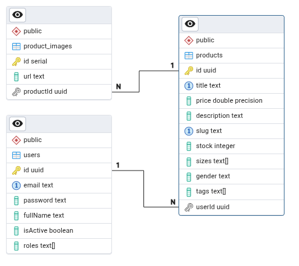

# API Shop

[API Shop](https://nxapi-shop.vercel.app)

## Models

- User
- Product
- ProductImage



## Data

- users.json
- products.json
- product_images.json


## Endpoints

- GET /api/products
- GET /api/products/:idOrSlug
- GET /api/products/all/:term

- POST /api/products

- PUT /api/products/:id
- DELETE /api/products/:id


- POST /api/auth/register
- POST /api/auth/login


## Tech Stack

- Next.js
- Prisma
- Postgres

## Setup

1. Clone the repository

```bash
git clone https://github.com/jamj2000/nxapi-shop.git
```

2. Install dependencies

```bash
cd  nxapi-shop 
npm install
```

3. Configure DATABASE_URL in .env

```bash
cp .env.example .env
```
Edit .env file and add your DATABASE_URL

4. Set up the database

```bash
npx prisma db push
```

5. Run the seed

```bash
npm run seed
```

6. Start the development server

```bash
npm run dev
```
            

